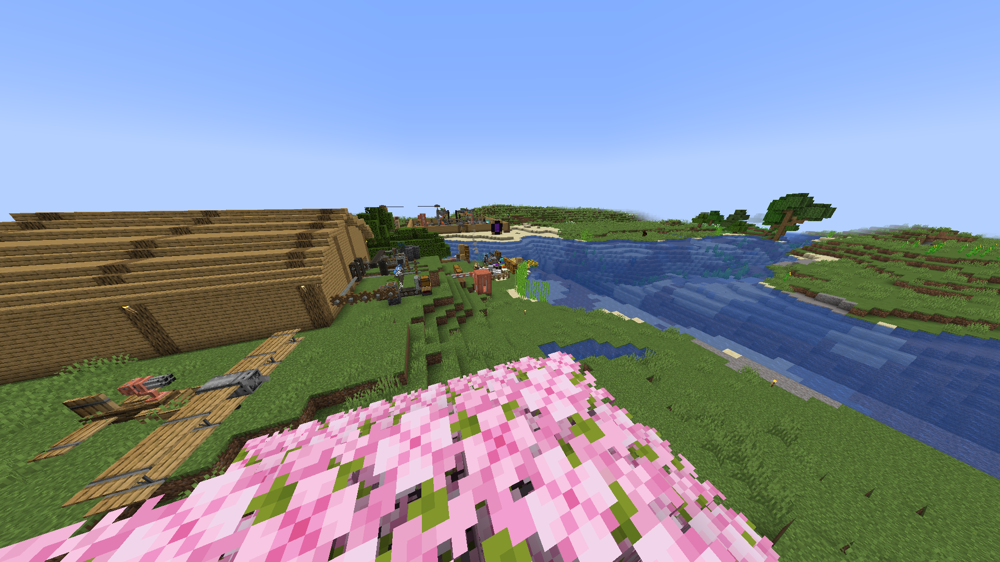
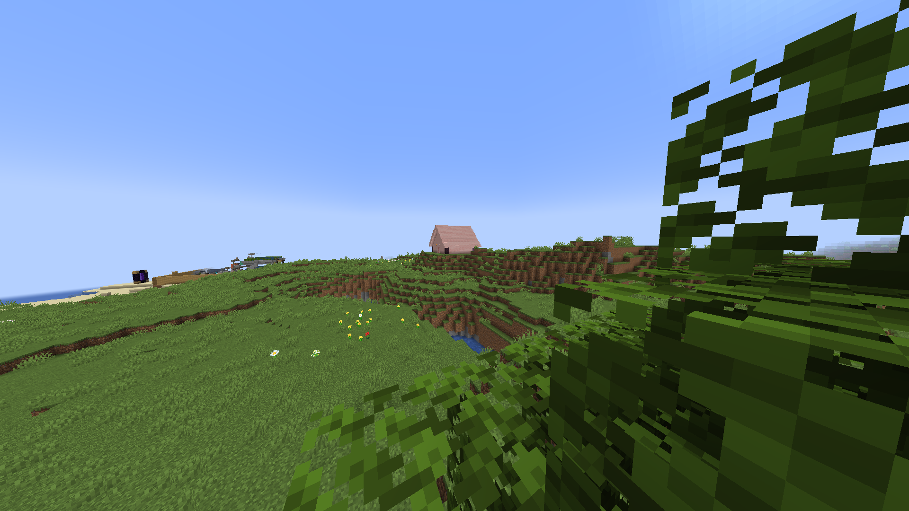

---- ACCESS GRANTED ----

Welcome "Remote admin", connected via: SSH
Security Clearence LvL: 4

---- SUBJECTS ----
* S-00957 (alias: "ReaperTheProto")
     NOTE: monitor at all costs
* [REDACTED] Security clearence lvl: 6  or higher required

[TEXT REDACTED]
'ERROR': Contact a security clearence lvl 6 or higher to view

---- INFO ----
* S-00957 (alias: "ReaperTheProto")
*      work area / main storage
*    

*    house
*    

---- LOGS ----
* S-00957
  
     * "2025-09-14: 00957 seems to be acting a little weird, we have no idea what's happening, will continue to monitor"

     * "2025-09-13: 00957: normal, nothing unusual, will continue to monitor
 
     *      ACCESS DENIED!: Security Clearence LvL: 6 or higher required
 

     * "2022-06-13: S-00957 (alias: "ReaperTheProto") is now a subject, per higher command requests, we will actively monitor 00957
 

---- MESSAGES ----

2025-09-14: COMMAND: how is 00957 doing?
     HRM: he's... acting weird, he's being more cautious
     COMMAND: what do you mean he's "acting weird" he was just fine yesterday
     HRM: i have no idea-
     COMMAND: never mind, how is he acting?
     HRM: he's acting like someone is watching him, constantly looking over hi-
     COMMAND: just keep monitoring him, be careful, we don't want another incident
     HRM: alright, we'll continue to monitor him, yeah that was awful, i'm surprised th-

     * CONNECTION TIMED OUT: RECOVERY FAILED

2025-09-13: COMMAND: how is 00957 doing?
     HRM: good, nothing out of the ordinary
     COMMAND: good, keep monitoring him
     HRM: will do

     * CONNECTION CLOSED: SAVED

* ACCESS DENIED!: Security Clearence LvL: 6 or higher required

